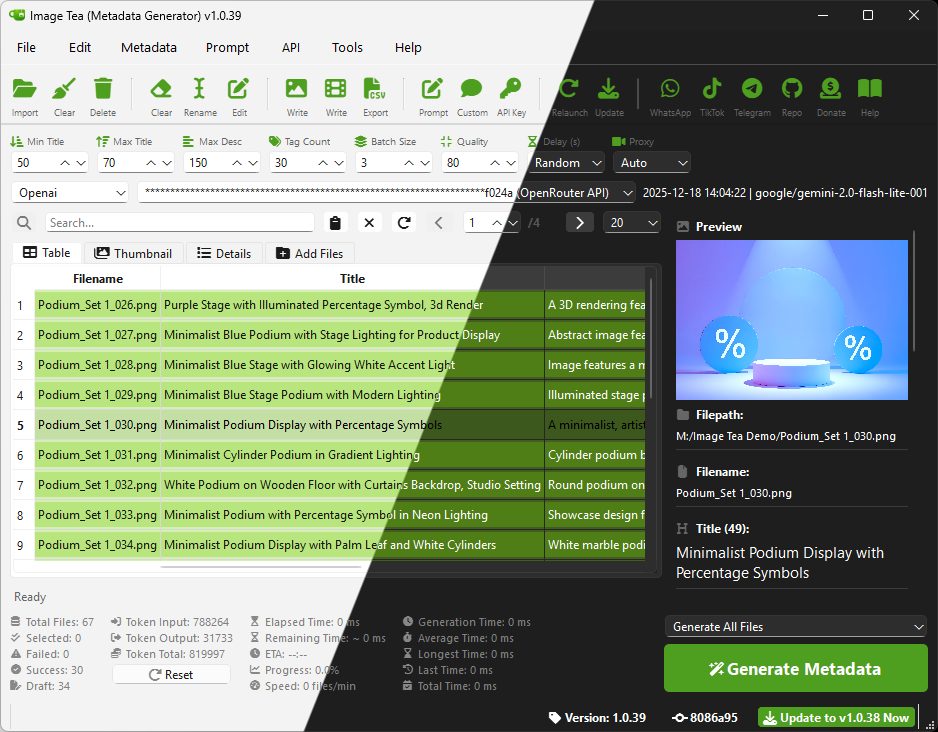

# Image-Tea-nano

## I'm sick of paying for something this basic. Every time I need a simple metadata generator, I hit a paywall. I'm done with it.

### SO I BUILT MY OWN!

- It's FREE.
- No trial. I don't want sweet promises and time limits.
- No trial. Yes, I already said it. I don't like trials.
- No need to subscribe to an app, because I don't want to.
- No sign-ups. No accounts. I don't need your data. I built this to get work done.
- No tracking. No analytics. I’m not your “usage data”.
- Portable. Copy the folder, it works. I’m not touching the registry.
- Same rules every time. Update or skip it, as long as the studio gets what it needs.
- Skip/Retry/Resume. I decide, not the app.
- I own the workflow. Not renting it.
- Easily customisable down to the most basic level.
- Prompts are fully adjustable. No hidden prompts. No "trust us" prompts.
- Needs an API key. So what? I don't mind.
- Need a feature? I just ask Copilot to build it.
- Works stubbornly and stays resilient.
- Fast, handles bulk batches with ease.
- Pause anytime. Continue anytime. Whenever I want.
- Full documentation. I’m forgetful, so I write everything down.
- Backup config. I don't like anything unpredictable.
- Studio first. Desainia Studio’s needs come first. Don’t like it? Don’t use it.
- Other apps are more complete. Chrome extensions. Multi-platform. Whatever. This works for Desainia Studio. That’s it. I already said it.
- Want it as an alternative? Go ahead. For us, this is the daily main tool.
- Can't afford a paid metadata generator? Use Image-Tea. Pay with prayers if that's all you have.
- If Image-Tea helped and your heart whispers “donate”, just do it. Your heart is right. I agree.
- If you use Image-Tea and need help, click the WhatsApp link above. It’s not there for decoration.
- Anyone can use it. I'm tired of being excluded.
- MIT License. Use it, change it, share it. Don't you dare remove the license.
- No warranty. I never promised one.

---

## Aku muak tiap butuh metadata generator yang simpel, ujungnya mentok ditodong bayar. Udah, Ogah.

### MAKANYA AKU BIKIN SENDIRI!

- GRATIS.
- Gak ada trial. Aku gak suka janji manis dan batas waktu.
- Gak ada trial. Iya, aku ulang. Aku gak suka trial.
- Gak perlu langganan aplikasi, karena aku gak mau.
- Gak perlu daftar-daftar. Gak ada akun. Aku gak butuh datamu. Aku cuma mau beres kerjaan.
- Gak ada ngintip-ngintip. Gak ada analytics. Aku bukan “data pemakaian” kamu.
- Portable. Tinggal salin folder, langsung jalan. Aku gak mau instal yang nyentuh registry.
- Aturannya konsisten. Mau update silakan, mau skip juga silakan. Yang penting kebutuhan studio kelar.
- Skip/Retry/Resume. Aku yang pegang kontrol, bukan aplikasinya.
- Workflow ini milikku. Bukan sewaan.
- Bisa dioprek sampai akar-akarnya.
- Prompt bebas diatur. Gak ada prompt disembunyiin. Gak ada gaya “percaya aja”.
- Butuh API key? Ya emang. Aku santai.
- Kurang fitur? Tinggal minta Copilot bikinin.
- Bandel. Tahan banting. Gak rewel.
- Ngebut. Nge-batch banyak pun enteng.
- Mau pause ya pause. Mau lanjut ya lanjut. Sesuka hati.
- Dokumentasi lengkap. Aku pelupa, jadi semua aku catat.
- Konfig dibackup. Aku gak suka yang suka berubah-ubah gak jelas.
- Studio dulu. Kebutuhan Desainia Studio nomor satu. Gak cocok? Ya udah, gak usah pakai.
- Aplikasi lain mungkin lebih wah: ekstensi Chrome, multi-platform, dll. Ya silakan. Ini yang penting jalan buat Desainia Studio. Udah.
- Mau dijadiin alternatif? Silakan. Di studio kami, ini alat harian utama.
- Kalau belum mampu beli yang berbayar, pakai aja Image-Tea. Bayarnya doa juga gapapa.
- Kalau kepake dan tiba-tiba kepikiran buat donasi, ya ikutin aja. Itu bisikan yang bener.
- Kalau pakai Image-Tea terus butuh bantuan, klik link WhatsApp di atas. Itu bukan hiasan.
- Siapa pun boleh pakai. Aku capek “dibatesin”.
- Lisensi MIT. Pakai, ubah, sebar. Jangan macam-macam hapus lisensinya.
- Tanpa garansi. Dari awal juga aku gak pernah janji.

