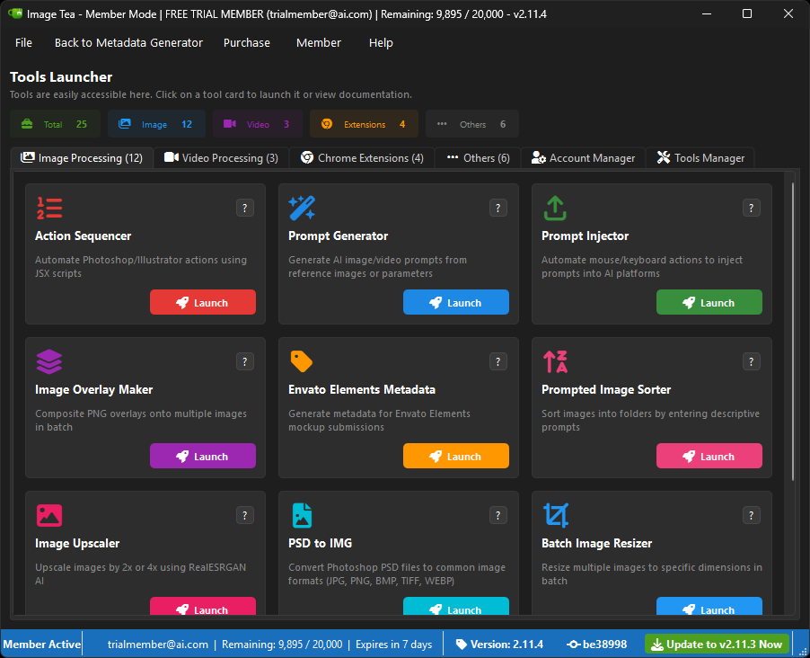
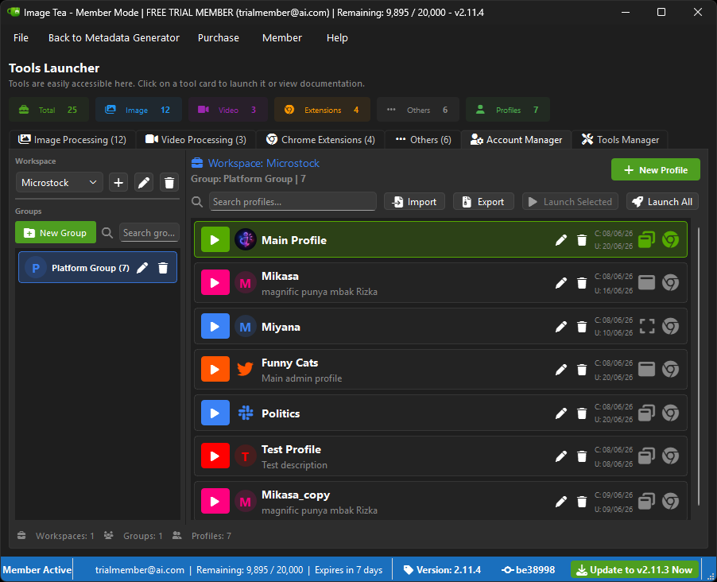

# Image-Tea-nano

  

> 🎉 Image-Tea is now fully cross-platform - Windows, Linux, and macOS!

  

  

---

## I got tired of hitting a paywall every time I needed a simple metadata generator. So I built my own. 👊

### 🧉 SO I BUILT MY OWN!

No trial. No subscription. No accounts. No tracking. Just paste your API key and go.

MIT License - use it, change it, share it. Don’t remove the license. 🤝

---

## 🚀 Getting Started

No Python installation required. No setup wizard. Just download and run.

### What you need

- 📶 A stable internet connection (first run only)
- 🔑 An API key from one of the supported providers above
- That’s it - seriously

---

### 📥 Step 1 - Download

Grab the latest release from the **[Releases page](https://github.com/mudrikam/Image-Tea-nano/releases)** and extract it anywhere you like. Desktop, USB drive, whatever - it’s fully portable. 📁

---

### ▶️ Step 2 - Run

**🪟 Windows**

Double-click **Image-Tea.exe**

On the very first launch, it will automatically download all required dependencies. Just wait for it to finish - the app will open by itself once it’s ready. ✅

> ⚠️ If Windows shows a SmartScreen warning - click **More info → Run anyway**

**🐧 Linux**

`bash
chmod +x Launcher.sh
./Launcher.sh
`

**🍎 macOS**

`bash
chmod +x Launcher.sh
./Launcher.sh
`

> ⚠️ If macOS blocks it - **System Settings → Privacy & Security → Allow Anyway**

On the first run, the launcher will automatically download and set up everything before opening the app. ✅

---

### 🔑 Step 3 - Add your API key

On first launch, Image-Tea will ask for your API key. Open your provider’s dashboard, copy the key, paste it in - done. 👌

> Your key never leaves your machine. No accounts. No registration.

---

## 🔄 Updates

Image-Tea will let you know on startup when there’s a new version. Update or skip - your call, always. 😎

---

## 🛠️ Troubleshooting

| Problem | Fix |
|---|---|
| SmartScreen blocks the exe | Click More info → Run anyway |
| Download hangs on first run | Check your internet connection and relaunch |
| App won’t open | Delete the python/Windows folder and relaunch - it will re-download |
| API key not accepted | Make sure the key is active and has credits |
| macOS blocks the script | System Settings → Privacy & Security → Allow Anyway |
| Linux: permission denied | Run chmod +x Launcher.sh first |

Still stuck? Drop a message in the **[WhatsApp Group](https://chat.whatsapp.com/CMQvDxpCfP647kBBA6dRn3)**. 💬

---

## Panduan Singkat

Gak perlu instal Python dulu. Gak perlu setup apa-apa. Tinggal download dan jalankan.

### Yang kamu butuhkan

- 📶 Koneksi internet stabil (cuma saat pertama kali)
- 🔑 API key dari salah satu provider di atas
- Udah, itu aja - serius

---

### 📥 Langkah 1 - Download

Ambil versi terbaru di **[halaman Releases](https://github.com/mudrikam/Image-Tea-nano/releases)**, ekstrak di mana aja. Desktop, flashdisk, terserah - portable sepenuhnya. 📁

---

### ▶️ Langkah 2 - Jalankan

**🪟 Windows**

Klik dua kali **Image-Tea.exe**

Saat pertama kali dibuka, aplikasi akan otomatis mengunduh semua dependensi yang dibutuhkan. Tunggu sampai selesai - aplikasi akan terbuka sendiri setelah siap. ✅

> ⚠️ Kalau Windows menampilkan peringatan SmartScreen - klik **More info → Run anyway**

**🐧 Linux**

`bash
chmod +x Launcher.sh
./Launcher.sh
`

**🍎 macOS**

`bash
chmod +x Launcher.sh
./Launcher.sh
`

> ⚠️ Kalau macOS memblokirnya - **System Settings → Privacy & Security → Allow Anyway**

Saat pertama kali dijalankan, launcher akan otomatis download dan setup semuanya sebelum membuka aplikasi. ✅

---

### 🔑 Langkah 3 - Masukkan API key

Saat pertama kali dibuka, Image-Tea akan minta API key. Buka dashboard provider kamu, salin key-nya, tempel di sana - selesai. 👌

> Key kamu gak kemana-mana. Gak ada akun. Gak ada registrasi.

---

## 🔄 Update

Image-Tea kasih tahu kalau ada versi baru pas startup. Mau update atau skip - terserah kamu. 😎

---

## 🛠️ Troubleshooting

| Masalah | Solusi |
|---|---|
| SmartScreen blokir exe | Klik More info → Run anyway |
| Download nyangkut saat pertama buka | Cek koneksi internet lalu buka ulang aplikasinya |
| Aplikasi gak mau buka | Hapus folder python/Windows lalu buka lagi - dia akan download ulang otomatis |
| API key ditolak | Pastikan key aktif dan ada kreditnya |
| macOS blokir script | System Settings → Privacy & Security → Allow Anyway |
| Linux: permission denied | Jalankan chmod +x Launcher.sh dulu |

Masih stuck? Tanya di **[Grup WhatsApp](https://chat.whatsapp.com/CMQvDxpCfP647kBBA6dRn3)**. 💬

---

MIT License © Mudrikul Hikam - Desainia Studio ❤️
